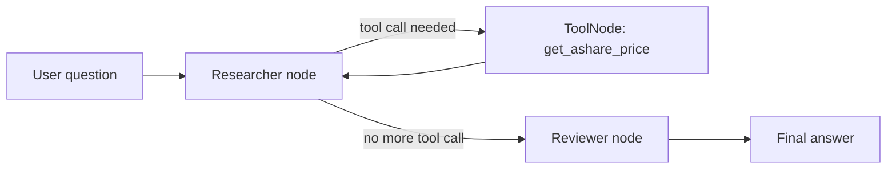

# LangGraph Finance Workflow Demo

A minimal finance Q&A and compliance-review workflow built with LangGraph.

## Highlights

- explicit `Researcher -> Tools -> Researcher -> Reviewer` workflow
- real tool-calling loop using `bind_tools`, `ToolNode`, and conditional routing
- Gradio-based interactive demo
- basic conversation history passing
- conservative public positioning with clear system boundaries

## What This Project Does

This demo organizes the following flow:

`Researcher -> Tools -> Researcher -> Reviewer`

It can:

- answer general workflow questions
- call a stock price query tool when needed
- draft a response after tool usage
- pass the draft through a conservative reviewer node
- expose the workflow through a simple Gradio chat interface

## Why I Built It

I wanted to separate:

- response generation
- tool usage
- output review

instead of putting everything into one large prompt.

The project is intentionally scoped as a **workflow demo**, not a production investment research platform.

## Workflow



## Tech Stack

- Python
- LangGraph
- LangChain
- Tool Calling
- Requests
- Gradio

## Repository Structure

```text
.
├── app.py
├── README.md
├── requirements.txt
├── .env.example
├── .gitignore
└── project_notes.md
```

## Main Components

### 1. Tool Layer

- `normalize_symbol`
- `parse_quote_response`
- `get_ashare_price`

This layer validates stock codes, formats target symbols, calls a public quote API, and returns a text result for the workflow.

### 2. Workflow Layer

- `State`
- `researcher_node`
- `ToolNode`
- `risk_reviewer_node`

This layer controls routing, tool invocation, draft generation, and final review.

### 3. UI Layer

- `build_history_messages`
- `chat_with_agent`
- `gr.ChatInterface`

This layer connects the graph to a simple local chat demo.

## Quick Start

```bash
python3 -m venv .venv
source .venv/bin/activate
pip install -r requirements.txt
cp .env.example .env
python app.py
```

## Environment Variables

```bash
OPENAI_API_KEY=your_api_key_here
OPENAI_API_BASE=https://api.openai.com/v1
PROJECT_2_MODEL_NAME=gpt-4o-mini
```

## Example Questions

- `请问贵州茅台（600519）现在的股价是多少？`
- `中金黄金现在的股价多少？如果你不确定代码就提醒我补充。`
- `你这个系统能做什么？`

## What I Can Defend In Interviews

- why LangGraph is useful when generation, tool calling, and review should be explicit
- how `bind_tools`, `ToolNode`, and `tools_condition` form a minimal tool loop
- why the reviewer is better described as a second role, not an independent second model
- why history passing is not the same thing as a full memory system

## Key Points I Can Explain

- Why LangGraph is useful for explicit node and edge design
- What `bind_tools`, `ToolNode`, and `tools_condition` do in a minimal tool-calling loop
- Why the `Researcher` and `Reviewer` are better described as two roles using one model instance
- Why prompt-based output review is still not the same as a full rule engine

## Current Boundaries

- Only one tool is implemented
- The workflow is still a demo-level system
- Review logic is prompt-based rather than policy-engine based
- History support is basic message passing, not a long-term memory system

## Safer Public Positioning

This repository should be presented as:

- a workflow orchestration demo
- a tool-calling and review pipeline practice project
- a local Gradio-based prototype

It should **not** be presented as:

- a production investment research system
- a full compliance engine
- a multi-tool finance platform

## Future Improvements

- add structured tool outputs instead of plain text responses
- add explicit stock-name-to-symbol mapping
- add rule-based checks alongside prompt-based review
- add retry, logging, and error-code handling for external calls

## Notes

This repository is meant to demonstrate explainable workflow orchestration and tool integration, with honest project boundaries kept explicit.
